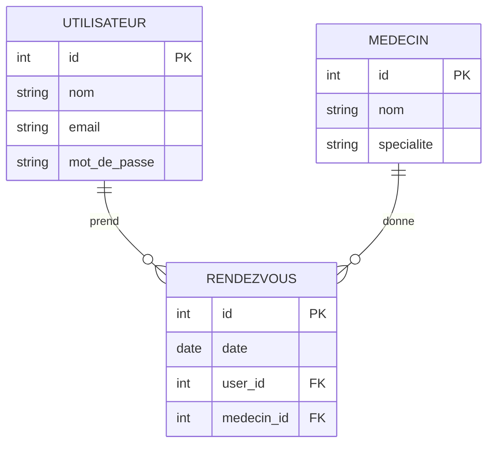

## Sommaire
1. [MySQL Database Design](#mysql-database-design)

## MySQL Database Design

### Table: patients
- id: INT, UNIQUE, Primary Key, NOT NULL, Auto Increment
- first_name: VARCHAR(50), NOT NULL
- last_name: VARCHAR(50), NOT NULL
- email: VARCHAR(50), NOT NULL
- hash: VARCHAR, NOT NULL
- CONSTRAINT UNIQUE(first_name + last_name)

### Table : doctors
- id: INT, UNIQUE, Primary Key, NOT NULL, Auto Increment
- first_name: VARCHAR(50), NOT NULL
- last_name: VARCHAR(50), NOT NULL
- email: VARCHAR(50), NOT NULL
- hash: VARCHAR, NOT NULL
- specialization: VARCHAR NOT NULL
- number: VARCHAR NOT NULL
- CONSTRAINT UNIQUE(first_name + last_name)

### Table appointments
- id: INT, UNIQUE, Primary Key, NOT NULL, Auto Increment
- doctor_id: INT, NOT NULL, Foreign Key -> doctors(id)
- patient_id: INT, NOT NULL, Foreign Key -> patients(id)
- appointment_date: DATETIME, NOT NULL
- status: INT(0 = Scheduled, 1 = Completed, 2 = Cancelled)
- CONSTRAINT UNIQUE(doctor_id + patient_id + appointment_date)

## MongoDB Collection Design

### Collection : prescriptions
```json
{
  "_id": "ObjectId('64abc123456')",
  "patientName": "John Smith",
  "appointmentId": 51,
  "medication": "Paracetamol",
  "dosage": "500mg",
  "doctorNotes": "Take 1 tablet every 6 hours.",
  "refillCount": 2,
  "pharmacy": {
    "name": "Walgreens SF",
    "location": "Market Street"
  }
}
```

### Collection : logs
```json
{
  "id": "id",
  "action": "Réservation de créneau",
  "status": "OK",
  "error": null
}
```

### Collection : messages
```json
{
  "id": "id",
  "sender": {
    "firstName": "John",
    "lastName": "Doe",
    "email": "mail",
    "role": "doctor"
  },
  "receiver": {
    "firstName": "John",
    "lastName": "Doe",
    "email": "mail",
    "role": "patient"
  },
  "content": "Ceci est un contenu",
  "date": "2024-12-04"
}
```


